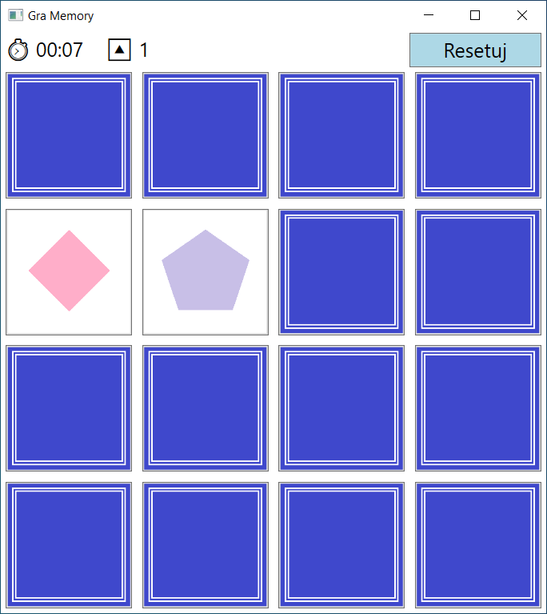

# Memory Game [EN]
This project is a simple memory card game (revealing and searching for pairs of cards) made in WPF using C# and XAML as a school project while learning to create desktop applications in WPF. The game interface has 16 cards (arranged in 4x4 grid), timer, exposed cards counter, and reset button.

&nbsp;

---

&nbsp;

# Gra Memory [PL]
Ten projekt to prosta gra memory (odsłanianie i szukanie par kart) napisana w WPF przy użyciu C# i XAML jako projekt szkolny podczas nauki tworzenia aplikacji desktopowych w WPF. Interfejs gry ma 16 kart (ułożone w siatce 4x4), licznik czasu, licznik odsłoniętych kart i przycisk reset.

